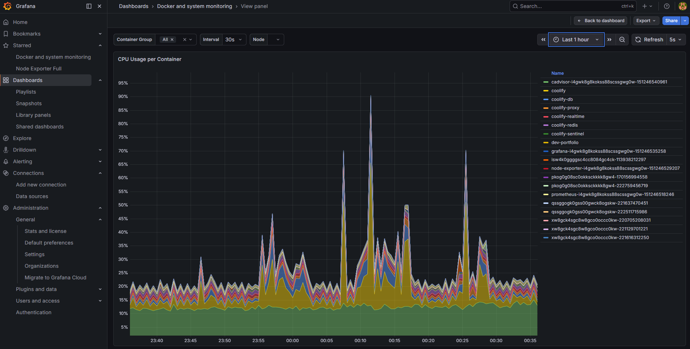

# Offloading Docker Builds with GHCR

While working on a client project building a website for a recruiting agency, I ran into an issue with my flow of deploying to my VPS. I own my own server where I use Coolify and open-source tooling to manage the infrastructure.

## The Problem: Builds Were Crashing My VPS

I was already running multiple other sites, and because it is a small VPS, I noticed that trying to redeploy and rebuild the container after an update would sometimes cause the VPS to crash. I would have to restart the whole server to get things running again.

*Grafana CPU usage graph showing build spikes*

I thought I had already hit the bottleneck and started thinking about buying a more powerful VPS. After some research, I came across the idea of using a container registry. I had seen the term before on another project where I used the Docker container registry to temporarily deploy a backend on an Azure instance, but I hadn’t thought much more about it at the time.

## What Changed

At first it did not click why this would solve my problem, but then I learned that GitHub Actions can do much more than just run tests. GitHub has its own container registry called GHCR, and pairing that with GitHub Actions means you can build the image in CI and push the built image to the registry.

I was already building the container in my CI pipeline, so I could push the built image to the registry, then let Coolify pull that prebuilt image and deploy it. That was the big difference: the container registry stores the image, it does not build it. The performance gain came from moving the expensive build step off the VPS.

## What Actually Improved

The difference was massive. CPU usage during deployment dropped by around 60%, meaning no more crashes. The overall time to deployment also went from about 1 minute to 1 minute 30 seconds down to around 10 seconds.

Plus, I saved money on buying a new VPS.

## What I Learned

I feel like this is just the beginning when it comes to finding out niche things like this. I remember even finding out I did not have to pay companies like Vercel an outrageous fee for hosting when I could just use an open-source alternative like Coolify.

I think moments like this are special though. Where is the fun if you cannot learn new things?
