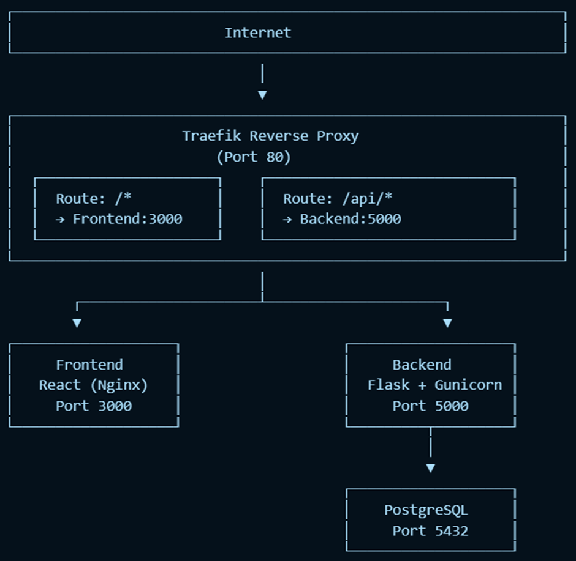
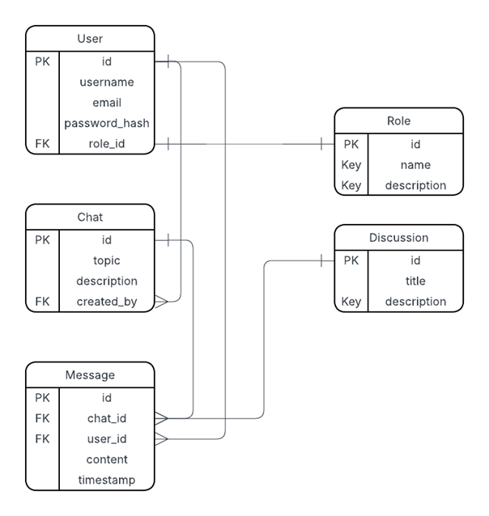
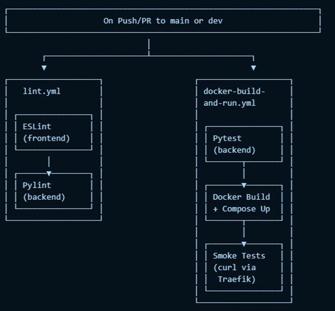
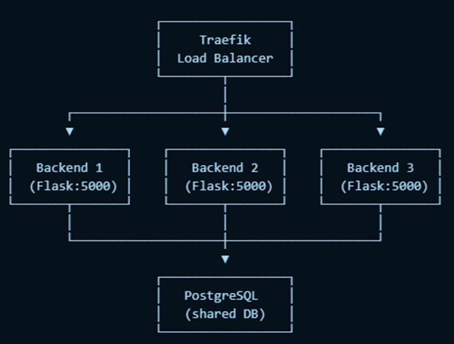
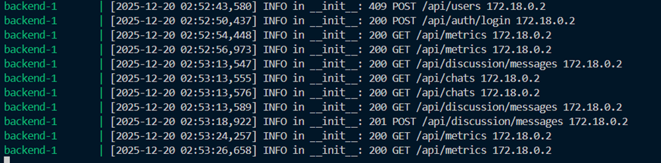
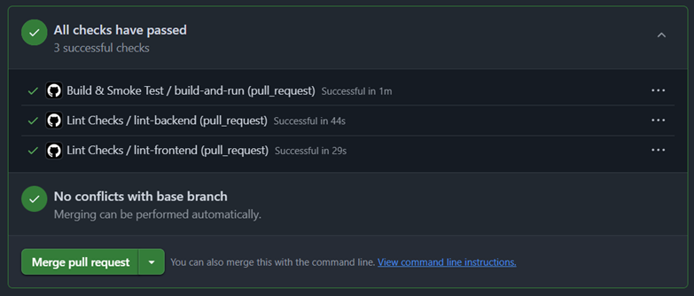
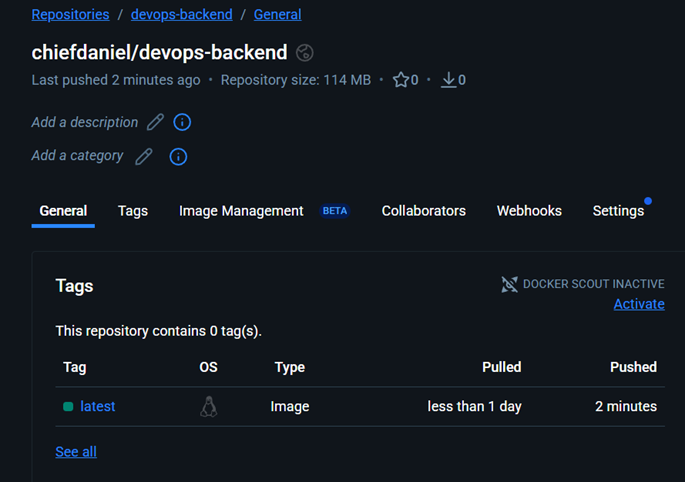

# DevOps Web Application

A three-tier web application built to demonstrate the core principles of DevOps culture — combining automation, scalability, collaboration, and continuous delivery throughout its architecture and workflows.  

The system functions as an **internal chat platform** paired with a **dashboard displaying live GitHub project metrics** to help development teams coordinate effectively. It was designed using containerized microservices and follows modern DevOps best practices from build to deployment.

## System Overview

The application uses a **three-tier architecture**:  
- **Frontend:** React SPA  
- **Backend:** Flask API  
- **Database:** PostgreSQL  

All tiers run in separate Docker containers, connected via Docker Compose.  
A **Traefik reverse proxy** sits at the edge of the system, routing traffic to the correct service internally:
- `/ → frontend` (port 3000)  
- `/api/... → backend` (port 5000)  

This design provides scalability and isolation while ensuring consistent deployments across environments.

**Architecture Diagram:**  

**Database Schema:**  

## Tools and Technology Rationale

### Frontend: React SPA
React was chosen for its reusable component structure, efficient state management, and virtual DOM rendering — ideal for chat messages and live dashboards. It also simplifies building single-page applications with smooth client-side routing.

### Backend: Flask
Flask powers the RESTful API, handling authentication, chat functionality, and metrics retrieval. Its lightweight, modular design (using the `create_app()` pattern and blueprints) promotes maintainability and aligns well with testing and observability goals.

### Database: PostgreSQL
PostgreSQL stores structured data such as users, messages, and chat logs, using foreign keys and JSON fields for flexible relationships. It integrates seamlessly with SQLAlchemy and runs as an official Docker image.

### Reverse Proxy: Traefik
Traefik routes and monitors HTTP traffic while automatically discovering backend services based on Docker labels. Compared to Nginx, it requires no manual reconfiguration during restarts, making it ideal for agile, containerized workflows.

## CI/CD and DevOps Practices

### Continuous Integration
GitHub Actions runs automated pipelines on every push or pull request:
- **ESLint** for frontend code quality  
- **Pylint** and **Pytest** for backend testing  
- **Smoke tests** that spin up the full stack, verify container connectivity, and call endpoints using `curl`

### Deployment & Infrastructure as Code
Local deployment is defined through a single `docker-compose.yml` that brings up all services and networking with one command (`docker compose up --build`).  
For cloud deployment, the backend image was pushed to Docker Hub and run via **Azure Container Instances (ACI)**.  
Future goals include implementing full Infrastructure-as-Code using **Bicep** or **Terraform** for repeatable cloud provisioning.

**CI/CD Overview:**  

## Maintainability & Scalability

- **Maintainability:** Flask's modular blueprints and feature-branch workflow ensure separation of responsibilities and easier updates.  
- **Scalability:** Horizontal scaling supported through Docker Compose (`--scale backend=n`), with Traefik handling load balancing automatically.  
- **Cloud Readiness:** Vertical scaling handled by adjusting ACI CPU and memory allocations, while PostgreSQL can migrate to a managed service for reliability.

**Scaling Diagram:**  

## Observability

System observability was achieved through structured logging in Flask using Python's logging module. Each request is logged with timestamp, method, path, status, and IP, forming a complete audit trail.
Logs can be viewed both locally (`docker logs`) and in Azure deployments using container insights.

**Example Logs:**  

## Security

Security features implemented include:
- **Hashed Passwords:** Using bcrypt for password storage  
- **Environment Secrets:** Managed via local `.env` excluded from version control  
- **Bot Protection:** Login form integrates Google reCAPTCHA  
- **Future Enhancements:** Role-based access control (RBAC) and rate limiting for brute-force protection  

## Evaluation & Reflection

This project successfully integrated DevOps fundamentals — containerization, CI/CD, testing, and observability — into a cohesive system.  
It strengthened my understanding of how to connect microservices, orchestrate pipelines, and debug containerized environments.  

Key wins:
- Seamless container orchestration with Docker and Traefik  
- Fully automated CI workflows  
- Scalable architecture ready for cloud migration  

Lessons learned:
- Early missteps with frontend framework selection (initially using Tkinter) delayed progress, but switching to React paid off enormously.  
- Understanding Docker's benefits firsthand made the deployment workflow clearer.  

Future improvements:
- Expand test coverage (frontend + integration tests)  
- Add RBAC and rate limiting  
- Replace manual Azure CLI configuration with Terraform IaC templates  

## Visuals

**CI Workflow Passing Tests**  

**Local Deployment Verification**  

## Links

- GitHub Repository under university organization
